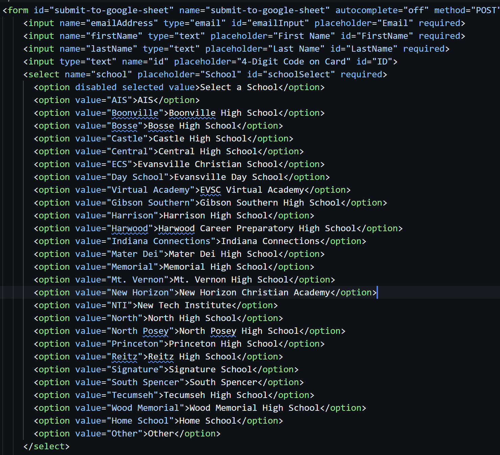
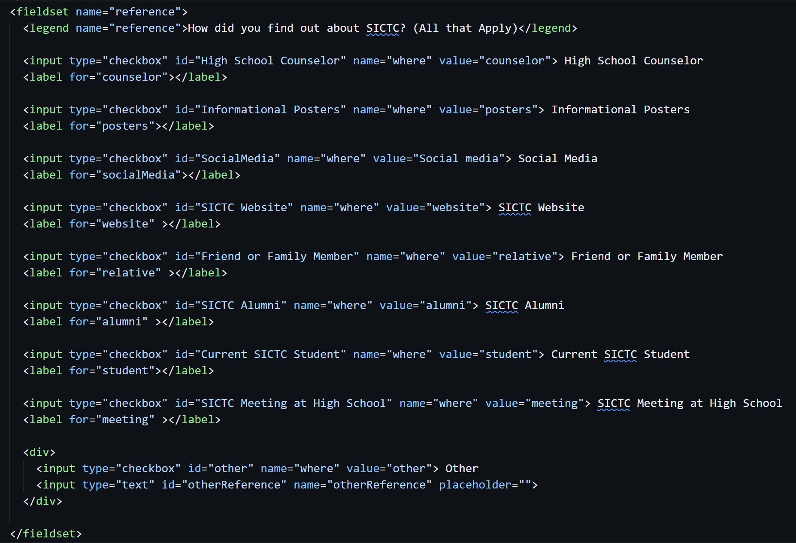
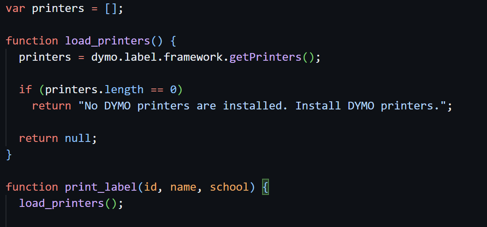

# OpenHouseSignIn

## Easy Changes
This shows simple changes that may need to occur further in time.

To add or remove a school from the form list go to Main Form/index.html and find this section
<break>

Then when you go to edit for the value that will be the text returned to the Google Sheet. And for the innerHTML that will be the text that displays on the form.

### To change the (How you heard about SICTC) checkboxes
You want to navigate to this part of the file
<break>

When you change something, the value tag will be what appears in the Google sheet or what is put inside an input is what will appear. The ID needs to be the header of the row for the sheets to autofill the values/inputs. 

## Setting up the Printers
The software needed to run the automatic printing.

### The LabelMaker software

https://sictccs2025.slack.com/files/U05P4QECLGP/F085J1TP5B4/dls8setup.8.5.4.exe

This is the software to create the template for the name badges. 

### Dymo Connect

https://sictccs2025.slack.com/files/U05P4QECLGP/F085WN50RH7/dcdsetup1.3.2.18.exe

This is the Dymo Connect Software which is the server needed to run the automatic printing.
It can be quite finicky. If it is not working go down to the hidden icons and hover over the Connect Icon. Then, reset the server until it works.

### Dymo SDK

https://download.dymo.com/dymo/Software/SDK/DYMO_Label_v.8_SDK_Installer.exe

This is the Software Development Kit, install and follow the instructions.

https://github.com/dymosoftware/DCD-SDK-Sample

This is a link to a github repo that contains examples. Scroll down to the Javascript examples for the relevant content and download the examples. These will help you to know if you have the right content installed and by inspecting, you can check your content.

## Using the Functions

<break>

These are the functions used in the printer.js file that are then called in the script.js. The first function uses the dymoframework to load in the printers into an array. 
Then the print_label function calls on the users name, id, and school to then pull the printer and actually print the label.\

Inside the printer.js is the xml for the label. If you change the label with the previous labelmaker software, then you will need to copy the XML and replace the large paragraph inside printer.js.

