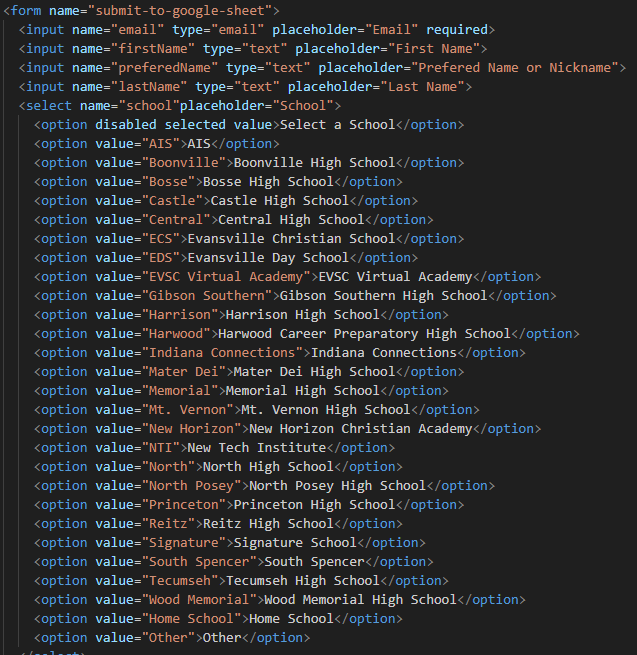
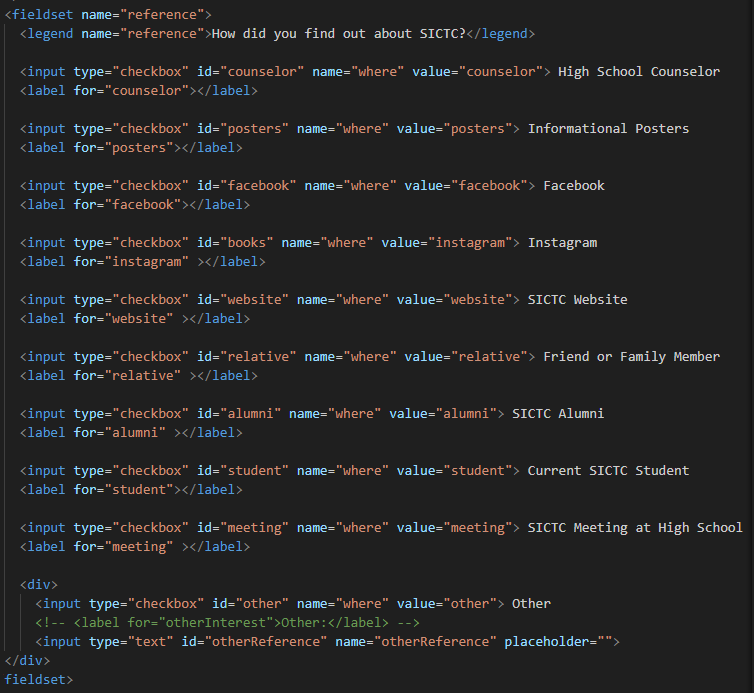

# OpenHouseSignIn
This shows simple changes that may need to occur further in time.

## Easy Changes
To add or remove a school from the form list go to Main Form/index.html and find this section
<break>

Then when you go to edit for the value that will be the text returned to the Google Sheet. And for the innerHTML that will be the text that displays on the form.

### To change the (How you heard about SICTC) checkboxes
You want to navigate to this part of the file
<break>

When you change something, the value tag will be what appears in the Google sheet or what is put inside an input is what will appear. The ID needs to be the header of the row for the sheets to autofill the values/inputs. 

